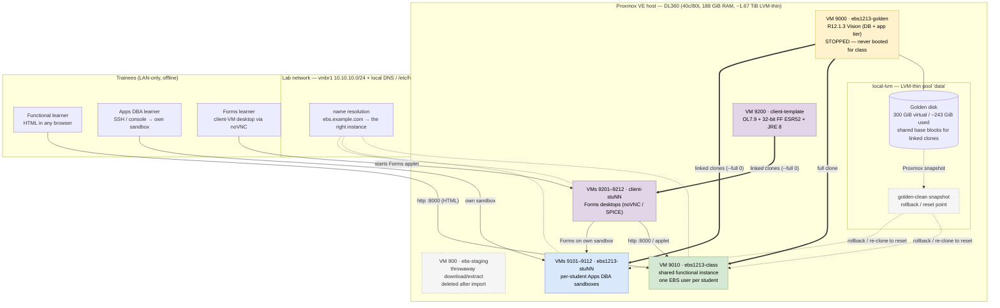

# Oracle E-Business Suite Training Lab on Proxmox

A self-hosted, offline, zero-license-cost lab for training students on **Oracle
E-Business Suite (EBS) R12.1.3 Vision**, built on a single HP ProLiant DL360
running Proxmox VE.

The goal is upskilling: give each student (and each new cohort) a working EBS
environment to practise on — functional navigation and setups, plus Apps DBA
work (patching, Autoconfig, cloning, admin utilities, DB administration).

---

## 1. Context and constraints

| Item | Value |
|------|-------|
| Host | HP ProLiant DL360 (2× Xeon Gold 6138, 40c/80t) |
| Hypervisor | **Proxmox VE 9.2.20** |
| RAM | **188 GiB** |
| Storage | **~1.67 TiB LVM-thin** (`local-lvm`) + ~85 GiB `local` dir |
| Internet | **Slow** (favours smaller downloads) |
| Audience | **6–15 concurrent** students |
| Budget | **$0** — no paid licenses, no cloud |
| Institution | Informal / non-commercial training (not Oracle Academy eligible) |
| Primary platform | **EBS 12.1.3 Vision** (pre-built Oracle VM appliance) |
| Optional later | EBS 12.2.12 Vision (for ADOP / WebLogic / DB 19c skills) |

### Why 12.1.3 first
- Pre-built single-node Vision **virtual appliance** is free to download from
  Oracle Software Delivery Cloud (`edelivery.oracle.com`).
- Much **lighter** than 12.2 (no WebLogic, database is 11g) → more instances fit
  on ~1.67 TiB / 188 GiB.
- Teaches core EBS architecture, Autoconfig, patching (`adpatch`), AD utilities,
  concurrent managers, cloning, and DBA fundamentals.

### Known trade-off
R12.1.3 is **end-of-life** and is *not* what most employers run today (modern
work is 12.2 + WebLogic + Online Patching/ADOP). Keep 12.1.3 for breadth and
scale, and add **one 12.2.12 instance** in a later phase for employability.

### Licensing (honest scope)
EBS is **not** free or open-source software. The edelivery download is free to
obtain but is governed by Oracle's standard terms. There is **no explicit free
classroom license**; Oracle Academy would be that route but this is not an
accredited institution. This lab is therefore scoped as an **offline, LAN-only,
non-commercial, development/self-study environment** with **no redistribution
and no production use**. Do not expose it to the public internet or use it to
deliver paid client work.

---

## 2. Target architecture

> GitHub renders the Mermaid diagram below. A plain-text ASCII version follows as a
> fallback for viewers that don't render Mermaid.



### How trainees connect
- **Functional learning — browser only.** Trainees open `http://<class-host>:8000/`
  in any normal browser and log in with **their own EBS username** on the shared
  class instance. No client VM is needed for the HTML/OAF pages.
- **Forms learning — client VM.** R12.1.3 Forms is a 32-bit Java applet. Each
  trainee opens **their own client VM desktop** through **noVNC** in the Proxmox web
  UI (or SPICE), then uses the bundled 32-bit Firefox ESR52 to launch Forms from the
  EBS URL. This is the *only* reason the client VMs exist.
- **Apps DBA learning — own sandbox.** Trainees get **SSH/console into their own EBS
  sandbox clone** (`9101–9112`) and practise destructive admin safely.
- **Names.** The lab VLAN + local DNS/`/etc/hosts` make the EBS hostname resolve to
  the correct instance for each trainee (see §9 for the `vmbr1` vs unique-hostname
  choice).

### What each component is for
| Component | VMID | What it is | Role in training |
|-----------|------|------------|------------------|
| **Golden base** | 9000 | Configured, password-changed R12.1.3 Vision (DB + app in one VM) | Source of truth for every clone; **stopped, never booted for class** |
| **`golden-clean` snapshot** | — | Proxmox snapshot of 9000 on `local-lvm` | **Rollback / reset point** — wipe a cohort's changes or re-clone cleanly |
| **Shared class instance** | 9010 | Full clone of 9000 | Functional practice for many trainees at once (one EBS user each); also the Forms target |
| **Student EBS sandboxes** | 9101–9112 | Linked clones of 9000 | Per-trainee **Apps DBA**: start/stop, `adadmin`, `adpatch`, AutoConfig, concurrent managers, cloning, RMAN |
| **Client template** | 9200 | OL7.9 + 32-bit Firefox ESR52 + 32-bit Oracle JRE 8 | Base image that can run the Forms applet |
| **Client clones** | 9201–9212 | Linked clones of 9200 | Each trainee's Forms desktop, reached via noVNC / SPICE |
| **Staging VM** | 900 | Throwaway Debian VM | Only downloads/extracts the appliance; delete after import |
| **Lab VLAN / DNS** | `vmbr1` | 10.10.10.0/24 + local DNS / `/etc/hosts` | Isolation + name resolution so `ebs.example.com` points at the right instance |

> The class instance and every sandbox are **full EBS installations** (their own DB
> + app tier), so clones are independent. Disk is preserved by **linked clones**
> (they share the golden base blocks); **RAM** is the constrained resource — cap how
> many run at once (§2.1).

### Plain-text fallback
```
Proxmox VE host (DL360 · 40c/80t · 188 GiB RAM · ~1.67 TiB LVM-thin)
|
|  local-lvm (thin pool "data")
|    golden disk: 300 GiB virtual / ~243 GiB used
|      `-- snapshot: golden-clean   (rollback/reset point; same pool)
|           `-- shared base blocks for every linked clone
|
|  VM 9000  ebs1213-golden      [STOPPED -- never booted for class]
|     |-- full clone -------->   VM 9010  ebs1213-class   (functional, shared)
|     `-- linked clones ----->   VMs 9101-9112  ebs1213-stuNN  (Apps DBA each)
|
|  VM 9200  client-template     (OL7.9 + 32-bit FF ESR52 + 32-bit Oracle JRE 8)
|     `-- linked clones ----->   VMs 9201-9212  client-stuNN  (Forms desktops)
|
`  VM 900   ebs-staging         (throwaway; delete after import)
                     |
         vmbr1 lab VLAN (10.10.10.0/24) + local DNS / /etc/hosts
                     |
   +-----------------+------------------+---------------------+
   |                 |                  |                     |
 Functional        Forms learner      Apps DBA learner      (offline / LAN only)
 learner:          (client VM,        (SSH/console ->
 browser -> :8000  noVNC or SPICE)    own sandbox)
   |                 |                  |
   +--> VM 9010 ebs1213-class (shared) <-- Forms applet from client VMs
```

### Resource budget (host: 188 GiB RAM, ~1.67 TiB)

| Item | vCPU | RAM | Disk |
|------|------|-----|------|
| EBS appliance (golden) | 4 | 12 GB | **300 GiB thin** (VMDK virtual size) |
| Shared class instance | 4 | 12 GB | clone |
| 12 × student EBS clones | 4 each | 10 GB each | linked deltas |
| Client template | 2 | 2 GB | 20–40 GB |
| 12 × client clones | 2 each | 2 GB each | linked deltas |

RAM: 12×10 + 12 + 12×2 = **~156 GB of ~188 GiB** — workable but **tight**; cap how
many EBS sandboxes run at once. Storage: golden ~300 GiB + class full clone + deltas
≈ **800–900 GiB of 1.67 TiB**, and only fits because clones are linked. Full detail:
`PLAN.md` §2.1.

---

## 3. Prerequisites

- Oracle account (free) for `edelivery.oracle.com`.
- A resuming download manager or `wget -c` (slow link; download is tens of GB).
- Free staging space (~**300 GB**) on the Proxmox host, exposed to the
  `ebs-staging` VM via NFS/9p (unzip + concatenate + extract).
- Proxmox storage that supports **linked clones / snapshots** — **LVM-thin, ZFS,
  or dir/qcow2** all qualify. Check with `pvesm status`.
- Local DNS or static `/etc/hosts` so EBS hostnames resolve for clients.

### Host verification (run these first — read-only)
```bash
pveversion
lscpu | grep -E 'Model name|Virtualization'
# Proxmox VE 8/9 needs x86-64-v2; the Gold 6138 passes:
lscpu | grep -o -E 'cx16|popcnt|sse4_2|lahf_lm' | sort -u
pvesm status
vgs; lvs
df -h
```

---

## 4. Phase 1 — Acquire the R12.1.3 Vision appliance

1. Sign in at <https://edelivery.oracle.com> (sign-in is now required even to
   browse).
2. Filter products by **Linux/OVM/VMs**.
3. Search by **Release** for `Oracle VM Virtual Appliance for Oracle E-Business
   Suite 12.1.3` (or search "e-business").
4. Confirm it is the **2014 "Virtual Appliances"** pack (Oracle Linux 6.5,
   compatible with Oracle VM Manager **and** VirtualBox) — **not** the older 2013
   "Oracle VM Templates" pack (Oracle Linux 5 + a **Xen-PV** kernel that will not
   boot on Proxmox). The Single Node VISION pack's catalog part numbers are
   **V46557-01 … V46563-01** (**seven** entries, each split 1-of-2 / 2-of-2 = 14
   zips, ~51.5 GB total).
5. Continue → accept the Oracle Standard Terms and Restrictions → download the
   media pack. Download is free with a free Oracle account; **no Support
   Identifier (CSI) is required**. If the site demands a CSI or payment, STOP —
   that is a different product.
6. Look for a **readme** — it lists the exact part/file names and (sometimes) the
   seeded OS/EBS passwords. **Caveat (verified 2026-10-02):** the actual 2014 pack
   we downloaded had **no separate readme inside the zips and no published
   checksums**; seeded passwords had to be taken from community sources and
   verified on the VM. Treat any credential as *try-first, then change it*.

> Availability caveat (checked 2026-09-29): Oracle's EBS VM page still lists the
> 12.1.3 appliance and cites Doc 1906691.1, but the eDelivery catalog is now
> behind sign-in and the latest *public* confirmation of the 12.1.3 pack on
> eDelivery is 2022. Confirm it is actually there before committing to the long
> download. EBS 12.1.3 entered **Sustaining Support on 2022-01-01**.

> Reference deployment guide: **My Oracle Support Doc ID 1906691.1 — Oracle VM
> Virtual Appliances for Oracle E-Business Suite Deployment Guide, Release 12.1.3.**
> The appliance ships **Oracle Linux 6.5**, EBS 12.1.3 (Apps RPC1, CPU Apr 2014),
> DB **11.2.0.4**, Forms/Reports **10.1.2.3**, JDK **1.7.0_60**.

Download with resume (slow links), **inside the `ebs-staging` VM**, into the
shared staging folder:
```bash
mkdir -p /srv/ebs-media && cd /srv/ebs-media   # mount of the host-shared folder
wget -c <each-file-url>
```

---

## 5. Phase 2 — Stage and extract the OVA

**All of Phase 1–2 runs inside the dedicated `ebs-staging` VM** (Debian 12/13, 2
vCPU, 2–4 GB RAM, ~32 GB OS disk + ~300 GB host-shared staging space) — not on
the host. Stage on a folder the host can later read for import (host NFS/9p
share, e.g. `/srv/ebs-media`). See `PLAN.md` §1.3.

```bash
cd /srv/ebs-media           # or wherever the shared staging folder is mounted
# 1) Unzip all parts
for z in *.zip; do unzip -n "$z"; done

# 2) Concatenate the split OVA parts into one file
#    (actual 2014 pack: each zip held Oracle-E-Business-Suite-12.1.3-VISION-INSTALL.ova.00 … .13)
cat Oracle-E-Business-Suite-12.1.3-VISION-INSTALL.ova.* \
    > EBS1213_VISION.ova

# 3) Extract the OVF + VMDK
tar xf EBS1213_VISION.ova
ls -lh *.ovf *.vmdk
```

> If the parts are `.ova.00`, `.ova.01`, ... use those names instead.
> You can delete the extracted/staging copies after the disk is imported.

---

## 6. Phase 3 — Import into Proxmox and create the VM

Use **i440fx + SeaBIOS + LSI SCSI (or SATA)** so the guest keeps its expected
disk device (`sda`) and does not need initramfs/virtio surgery.

```bash
# Create the VM shell (adjust VMID/storage names)
# NOTE: use --cpu Westmere, NOT host — the OL6 UEK kernel panics on host CPU flags.
qm create 9000 --name ebs1213-golden \
  --memory 12288 --cores 4 --sockets 1 \
  --cpu Westmere --machine pc --bios seabios \
  --scsihw lsi --ostype l26 --balloon 0 \
  --net0 e1000,bridge=vmbr0 --onboot 0

# Import the extracted VMDK, then attach it.
# NOTE: on LVM-thin (local-lvm) the disk is stored as raw; --format qcow2 only
# applies to file storage (dir/NFS), so omit it here.
qm importdisk 9000 /srv/ebs-media/<VMDK-FILENAME> local-lvm
qm set 9000 --scsi0 local-lvm:vm-9000-disk-0
qm set 9000 --boot order=scsi0

# Optional: console access
qm set 9000 --serial0 socket --vga std

qm start 9000
qm terminal 9000      # or use the web console
```
> `qm importovf` is an alternative that **creates the VM itself** (don't also run
> `qm create`): `qm importovf 9000 /srv/ebs-media/<OVF-FILENAME> local-lvm`, then
> `qm set 9000 --machine pc --bios seabios --scsihw lsi --balloon 0 --net0 e1000,bridge=vmbr0`.

Notes:
- Use the **2014 "Virtual Appliances" media pack** (OL 6.5, OVM/VirtualBox
  compatible), **not** the older 2013 "Oracle VM Templates" pack (Oracle Linux 5
  and a **Xen-PV** kernel that will not boot outside Oracle VM).
- NIC: `e1000` is the safe first choice for this Oracle Linux 6.5 guest;
  `virtio` usually works but verify. Keep `--balloon 0` (fixed RAM) for the DB.
- If networking is broken, check NIC name drift: OL6 normally uses `eth0`. Fix
  `/etc/udev/rules.d/70-persistent-net.rules` and
  `/etc/sysconfig/network-scripts/ifcfg-eth0` if it came up as `eth1`.
- The source VMDK is a **compressed `streamOptimized`** file (~54 GiB on disk)
  with a **300 GiB virtual size**. `qm importdisk` expands it into a 300 GiB
  LVM-thin volume that actually maps **~243 GiB** (the Vision install incl. the DB
  filesystem). Do **not** shrink below 300 GiB — the guest expects its
  `sda`/partition table.
- This is an Oracle VM/VirtualBox appliance running on an **uncertified**
  Proxmox/KVM path — treat it like any OVA import.

---

## 7. Phase 4 — First boot, network reconfigure, verification

1. Boot the VM and log in at the console (there was **no readme in the media**;
   the seeded `root` password must be taken from community sources and verified,
   then changed).
2. Set a **static IP** on the lab VLAN and configure hostname + `/etc/hosts`.
3. Reconfigure the EBS network/hostname per **MOS Doc 1906691.1** (listener,
   `tnsnames`, context file, then Autoconfig).
4. Start the EBS services via the appliance's admin scripts, then verify the
   login page:
   - Default HTTP port is typically **8000**; the DB listener is **1521**.
     (Forget `7001` — that is a 12.2/WebLogic port, not 12.1.3.) Confirm, e.g.:
     ```bash
     netstat -tlnp | grep -E '8000|1521'
     ```
   - Browse to `http://<ip>:8000/OA_HTML/AppsLogin`.
5. **Change every default password** (OS users, DB SYS/SYSTEM/APPS, EBS seeded
   users, WebLogic/OC4J if applicable).

### Useful EBS environment
**Actual layout (verified 2026-10-03):** the **apps tier** is under
`/u01/install/APPS`; the **DB tier** is under `/u01/install/VISION`. The `oracle`
OS user owns both, and **all AD/admin scripts must run as `oracle`** (not root).
Appliance wrappers:
```bash
/u01/install/VISION/scripts/startvisiondb.sh   # listener + DB (run as oracle)
/u01/install/APPS/scripts/startapps.sh         # app tier (run as oracle; feeds APPS pw)
/u01/install/APPS/scripts/stopapps.sh          # stop app tier
```
Instance/env (verified):
```bash
source /u01/install/APPS/apps/apps_st/appl/APPSEBSDB_ebs.env   # CONTEXT_NAME=EBSDB_ebs
echo "$ADMIN_SCRIPTS_HOME"        # = /u01/install/APPS/inst/apps/EBSDB_ebs/admin/scripts
```
Common admin scripts (run as `oracle`, after sourcing the env):
```bash
$ADMIN_SCRIPTS_HOME/adautocfg.sh appspass=apps  # AutoConfig — regenerates .dbc etc.
$ADMIN_SCRIPTS_HOME/adopmnctl.sh  status        # OPMN: oacore/forms/oafm/OHS
$ADMIN_SCRIPTS_HOME/adapcctl.sh   status        # Apache (OHS)
$ADMIN_SCRIPTS_HOME/adoacorectl.sh status
$ADMIN_SCRIPTS_HOME/adcmctl.sh    status        # concurrent managers
$ADMIN_SCRIPTS_HOME/adstrtal.sh                 # start all (prompts for APPS password)
$ADMIN_SCRIPTS_HOME/adstpall.sh                 # stop all
```
> **Gotcha (learned 2026-10-03):** `$INST_TOP/appl/fnd/12.0.0/secure/EBSDB.dbc`
> must be **generated by AutoConfig**. If it is still the shipped `template.dbc`
> (`DB_HOST=host_name`, `DB_PORT=port_number`), OACORE returns HTTP **500** on
> `/OA_HTML/AppsLogin`. Fix with `adautocfg.sh appspass=apps` as `oracle`, then
> restart the app tier.
> **Do not** use `/u01/install/scripts/configwebentry.sh` here — it is hardcoded
> to the context `EBSDB_apps`, but this instance is `EBSDB_ebs`. Prefer
> `$ADMIN_SCRIPTS_HOME/adautocfg.sh`.

---

## 8. Phase 5 — Golden template and snapshots

```bash
# Stop the EBS tiers cleanly first (as oracle), then halt the OS:
su - oracle -c "/u01/install/APPS/scripts/stopapps.sh"
su - oracle -c "/u01/install/VISION/scripts/stopvisiondb.sh"
ssh root@<ip> 'shutdown -h now'      # `qm shutdown 9000` times out — no acpid
qm snapshot 9000 golden-clean --description "Pristine R12.1.3 Vision, pw changed"

# Convert to a template (optional; keeps it from accidental boots)
qm template 9000
```

Booting the golden VM for class is forbidden — clone it instead.

> **Verified 2026-10-03:** `qm shutdown 9000` does **not** power off this guest
> (ACPI power button ignored — no `acpid`). Either `ssh root@<ip> 'shutdown -h now'`
> or `qm shutdown 9000 --forceStop 1`. Also stop the EBS tiers first so the DB
> shuts down cleanly.

---

## 9. Phase 6 — Shared class instance, student EBS clones, and client clones

```bash
# Shared functional instance
qm clone 9000 9010 --name ebs1213-class --full 1
qm set 9010 --memory 12288 --onboot 1

# Per-student EBS linked clones (small deltas; requires linked-clone storage)
for i in $(seq -w 1 12); do
  qm clone 9000 91$i --name ebs1213-stu$i --full 0
  qm set 91$i --memory 10240 --onboot 0
done
```

Then clone the **client template (9200)** built in §10:
```bash
for i in $(seq -w 1 12); do
  qm clone 9200 92$i --name client-stu$i --full 0
  qm set 92$i --memory 2048 --onboot 0
done
```

Networking is the main gotcha: every clone is a **full EBS** configured for
`ebs.example.com`, so several clones cannot answer to that one name on the same
LAN. Either give each clone a **unique hostname + static IP** and re-run
`$ADMIN_SCRIPTS_HOME/adautocfg.sh` as `oracle` (do **not** use `configwebentry.sh`
— it is hardcoded to the `EBSDB_apps` context), with matching client `/etc/hosts`
entries; or use the isolated **`vmbr1` VLAN + local DNS** so `ebs.example.com`
resolves to each student's own sandbox. `vmbr1` is the cleaner, intended design.

Access model: the class clone is for **functional** use — create **one EBS user
per student** (SYSADMIN → Security → Users) and share the instance. Give each
student their own **Apps DBA sandbox** clone for destructive admin practice, and
their own **client VM** for Forms. HTML pages work in any browser; Forms needs
the 32-bit Firefox ESR52 + Oracle JRE 8 client (§10).

> **RAM budget:** 12×EBS (10 GB) + class (12 GB) + 12×client (2 GB) ≈ **156 GB of
> ~188 GiB**. Cap how many EBS sandboxes run simultaneously.

---

## 10. Phase 7 — Client access (Forms applet)

**Decided 2026-09-29:** one **Oracle Linux 7.9 client VM per student** (template
**9200** → clones **9201–9212**), running the legacy applet stack so the **stock
12.1.3 appliance needs no server patching**:

- Browser: **32-bit Firefox ESR 52.9.0esr** (Mozilla archive) — last NPAPI build.
- Runtime: **32-bit Oracle JRE 8** (`linux-i586`) — the only runtime with
  `libnpjp2.so`; free for non-commercial/self-study.
- Wiring: `ln -s <jre>/lib/i386/libnpjp2.so ~/.mozilla/plugins/` → verify in
  `about:plugins`.
- Access: **noVNC in-browser** (default; Proxmox user with `VM.Console`),
  **SPICE** optional (`vga: qxl` + `virt-viewer`). RDP rejected (xrdp unavailable
  on Oracle Linux 7).
- Disable auto-updates; add the EBS URL to the Java **Exception Site List** and
  allow legacy/SHA-1 JARs.

**Build the client template once** (install OL7.9 + i686 libs, Firefox ESR52,
JRE 8, plugin), confirm a Forms screen opens, then snapshot and linked-clone it to
9201–9212. See `PLAN.md` §1.4 and `RESEARCH.md` §7.

**Community/uncertified config:** Oracle certifies the FF-ESR52 + JRE8 plugin path
on **Windows only**. The Oracle-supported alternative — **Java Web Start (JWS)** —
needs server-side patches on 12.1.3 and is deferred. MVP-A skips all of this;
validate the HTML login page from any browser first.

---

## 11. Phase 8 — Curriculum, batches, and reset

### Free learning material
- Oracle **MyLearn / Learning Explorer** — free EBS and Database courses.
- Oracle EBS 12.1.3 Documentation Library.
- Community walkthroughs (e.g. techgoeasy, rishoradev) for cross-checks.

### Suggested tracks
- **Functional:** navigation, responsibilities, setups, order-to-cash,
  procure-to-pay, GL/AP/AR basics.
- **Apps DBA:** `adadmin`, `adpatch`, Autoconfig, AD utilities, concurrent
  managers, file system layout, cloning, RMAN, 11g database administration.

### Reset between batches
```bash
# Option A: roll student clones back to the snapshot
for i in $(seq -w 1 12); do qm rollback 91$i golden-clean; done

# Option B: destroy and re-clone from the template (cleanest)
for i in $(seq -w 1 12); do
  qm stop 91$i --skiplock 1 || true
  qm destroy 91$i --purge 1
  qm clone 9000 91$i --name ebs1213-stu$i --full 0
done

# Client clones: same idea, from the client template (9200)
for i in $(seq -w 1 12); do
  qm stop 92$i --skiplock 1 || true
  qm destroy 92$i --purge 1
  qm clone 9200 92$i --name client-stu$i --full 0
done
```

---

## 12. Phase 9 (optional) — Add one R12.2.12 instance

For modern employability skills (WebLogic, **Online Patching/ADOP**, DB 19c,
Edition-Based Redefinition):
- Download **Oracle VM Virtual Appliance for Oracle E-Business Suite 12.2.12**
  (announced May 2023; deployment guide **MOS 2933812.1**). Size is large
  (tens of GB, roughly ~68 GB across multiple parts — *verify on edelivery*).
- Same import method; allow **24–32 GB RAM** and **~400 GB** disk.
- R12.2.12 ships **Oracle Linux 7.9 + DB 19c + WebLogic + Forms/Reports 10.1.2.3**.
- 12.2.12 has **Java Web Start (JWS) preconfigured**, so Forms access is easier
  than 12.1.3 (which needs JWS patching) — still needs a client JRE 8.

Budget impact: one 12.2 instance reduces the number of 12.1 clones you can run
concurrently. Add it only after the 12.1 lab is stable.

---

## 13. Troubleshooting quick reference

| Symptom | Likely cause / fix |
|---------|--------------------|
| Boot hangs / no disk | Wrong controller; use LSI SCSI or SATA, i440fx + SeaBIOS |
| Kernel panic on boot (`dtrace_psinfo_alloc`) | `--cpu host` panics the OL6 UEK kernel → use `qm set <id> --cpu Westmere` |
| SSH "no matching host key type found" | OL6 sshd only offers `ssh-rsa` → `ssh -oHostKeyAlgorithms=+ssh-rsa root@<ip>` |
| NIC is `eth1` | Delete `/etc/udev/rules.d/70-persistent-net.rules`, fix `ifcfg-eth0`, reboot |
| Login page blank / applet error | Client browser/JRE mismatch — see §10 and `PLAN.md` §1.4 (applet needs 32-bit FF ESR52 + 32-bit Oracle JRE 8) |
| DB not up | Check listener (`lsnrctl status`), `$ORACLE_HOME`, alert log |
| Services won't start after clone | Verify hostname/IP/`/etc/hosts`, run Autoconfig |
| Login page **HTTP 500** (OC4J servlet error) | FND `.dbc` is still the shipped `template.dbc` (`DB_HOST=host_name`) → run `adautocfg.sh appspass=apps` as `oracle`, then `startapps.sh` |
| OACORE/OAFM show `Init` right after start | Timing — wait 30–60 s; re-check `adopmnctl.sh status` (they go `Alive`) |
| `qm shutdown` times out / VM stays running | Guest has no `acpid` → stop tiers, then SSH `shutdown -h now` (or `qm shutdown <id> --forceStop 1`) |
| Out of space on host | Remove staging OVA/zips; use linked clones; check `lvs`/`df` |

---

## 14. Repository files

| File | Purpose |
|------|---------|
| `PROGRESS.md` | **Live execution status — where the build left off** |
| `README.md` | This plan and runbook |
| `AGENTS.md` | Core context for AI agents starting a new session |
| `PLAN.md` | OS choices (all roles), resource BOM, and per-phase verification |
| `RESEARCH.md` | Platform research + decision record (12.1.3 vs 12.2.12, sources) |
| `MVP-RUNBOOK.md` | Literal step-by-step for the first working instance (MVP-A/B) |
| `PHASE1-CHECKLIST.md` | Tickable Phase 1 execution checklist (host verify + appliance download) |

---

## 15. References

- Oracle Software Delivery Cloud — <https://edelivery.oracle.com>
- Oracle VM Templates for E-Business Suite —
  <https://www.oracle.com/virtualization/technologies/vm/e-business-suite.html>
- MOS Doc **1906691.1** — Deployment Guide, EBS 12.1.3 Virtual Appliances
  (12.2.12 guide: **2933812.1**)
- Oracle EBS 12.1.3 Documentation Library
- Oracle MyLearn — <https://mylearn.oracle.com>
"# OracleEBSLocalHosting" 
